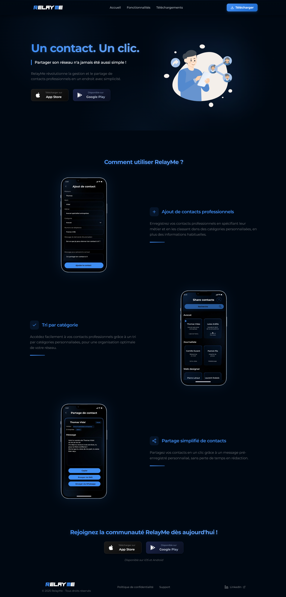

# RelayMe-Website

Bienvenue sur le dépôt du site web officiel de RelayMe, une application mobile qui simplifie la gestion et le partage de contacts professionnels. Ce site est conçu pour présenter les fonctionnalités de l'application, fournir des liens de téléchargement vers les stores (App Store et Google Play), et offrir des informations sur la politique de confidentialité et le support. Le site est entièrement responsive, s'adaptant parfaitement aux écrans mobiles, tablettes et ordinateurs.



## Structure du projet

```
RelayMe-Website/
├── public/                  # Ressources statiques accessibles publiquement
│   ├── ajout.webp           # Image pour la fonctionnalité d'ajout de contacts
│   ├── autorisation.webp    # Image pour le partage de contacts
│   ├── cadre.webp           # Cadre pour la vidéo de tri
│   ├── favicon.webp         # Favicon du site
│   ├── logo.webp            # Logo de RelayMe
│   ├── tri.mp4              # Vidéo démontrant le tri des contacts
│   └── website.webp         # Capture d'écran du site
├── src/                     # Code source du projet
│   ├── assets/              # Ressources comme les animations
│   │   └── Animation.json   # Animation Lottie pour la section Hero
│   ├── components/          # Composants React réutilisables
│   │   ├── CTA.tsx          # Call-to-Action pour inciter au téléchargement
│   │   ├── Features.tsx     # Section des fonctionnalités de RelayMe
│   │   ├── Footer.tsx       # Pied de page avec liens et copyright
│   │   ├── Header.tsx       # En-tête avec navigation
│   │   ├── Hero.tsx         # Section principale avec animation
│   │   ├── ScrollHandler.tsx# Gestion du défilement fluide
│   │   └── StoreButtons.tsx # Boutons de redirection vers les stores
│   ├── pages/               # Pages spécifiques
│   │   ├── PrivacyPolicy.tsx# Page de politique de confidentialité
│   │   └── Support.tsx      # Page de support
│   ├── App.tsx              # Composant principal de l'application
│   ├── index.css            # Styles globaux avec Tailwind CSS
│   ├── main.tsx             # Point d'entrée pour React
│   └── vite-env.d.ts        # Définitions TypeScript pour Vite
├── .gitignore               # Fichiers/dossiers à ignorer par Git
├── eslint.config.js         # Configuration ESLint
├── index.html               # Fichier HTML principal
├── package.json             # Dépendances et scripts npm
├── postcss.config.js        # Configuration PostCSS
├── README.md                # Fichier README (ce document)
├── tailwind.config.js       # Configuration Tailwind CSS
├── tsconfig.app.json        # Configuration TypeScript pour l'application
├── tsconfig.json            # Configuration TypeScript globale
├── tsconfig.node.json       # Configuration TypeScript pour Node
└── vite.config.ts           # Configuration Vite
```

## Prérequis

Pour exécuter ce projet localement, vous devez avoir installé :

- Node.js (version 18 ou supérieure recommandée)
- npm (inclus avec Node.js)

## Installation

Clonez ce dépôt sur votre machine locale :

```bash
git clone https://github.com/KyllianGenot/RelayMe-Website.git
```

Accédez au dossier du projet :

```bash
cd RelayMe-Website
```

Installez les dépendances :

```bash
npm install
```

## Lancer le projet en local

Pour démarrer le serveur de développement et voir le site en local :

```bash
npm run dev
```

Une fois le serveur lancé, ouvrez votre navigateur et accédez à http://localhost:5173 (ou le port indiqué dans le terminal).

Le site est entièrement responsive et peut être testé sur différents appareils ou tailles d'écran via les outils de développement de votre navigateur.

## Personnalisation des liens vers les stores

Pour publier le site et le rendre fonctionnel, vous devez mettre à jour les liens de redirection vers les applications sur l'App Store et Google Play. Ces liens se trouvent dans le fichier `src/components/StoreButtons.tsx`. Modifiez les attributs href des balises `<a>` comme suit :

```tsx
// src/components/StoreButtons.tsx

  href="https://apps.apple.com/app-id" // Remplacez par le lien réel de l'App Store
  target="_blank"
  rel="noopener noreferrer"
  className="app-store-button flex items-center justify-between"
  onMouseEnter={() => setHoverApple(true)}
  onMouseLeave={() => setHoverApple(false)}
>
  {/* ... */}
</a>


  href="https://play.google.com/store/apps/details?id=app-id" // Remplacez par le lien réel de Google Play
  target="_blank"
  rel="noopener noreferrer"
  className="google-play-button flex items-center justify-between"
  onMouseEnter={() => setHoverGoogle(true)}
  onMouseLeave={() => setHoverGoogle(false)}
>
  {/* ... */}
</a>
```

- Remplacez "https://apps.apple.com" par le lien spécifique de votre application sur l'App Store.
- Remplacez "https://play.google.com" par le lien spécifique de votre application sur Google Play.

## Fonctionnalités principales du site

- **Section Hero** : Présente RelayMe avec une animation Lottie et des boutons de téléchargement.
- **Fonctionnalités** : Décrit les avantages de RelayMe (ajout de contacts, tri par catégorie, partage simplifié) avec des images et une vidéo.
- **CTA** : Encourage les visiteurs à rejoindre la communauté RelayMe.
- **Navigation** : Header fixe avec menu responsive (mobile et desktop).
- **Pages annexes** : Politique de confidentialité et support, accessibles via le footer.
- **Design** : Utilisation de Tailwind CSS pour un style moderne et responsive.

## Déploiement

Pour générer une version optimisée du site prête à être déployée :

```bash
npm run build
```

Les fichiers générés seront placés dans le dossier `dist`. Vous pouvez les uploader sur un hébergeur comme Netlify, Vercel ou GitHub Pages.

## Technologies utilisées

- **React** : Bibliothèque JavaScript pour la construction de l'interface.
- **TypeScript** : Typage statique pour un code robuste.
- **Vite** : Outil de build rapide et moderne.
- **Tailwind CSS** : Framework CSS pour un design rapide et responsive.
- **React Router** : Gestion des routes pour les pages.
- **Lucide React** : Icônes modernes et personnalisables.
- **Lottie** : Animation dans la section Hero.

## Contact

Pour toute question ou assistance, consultez la page Support (`src/pages/Support.tsx`) ou utilisez le formulaire : https://tally.so/r/waz2O2.